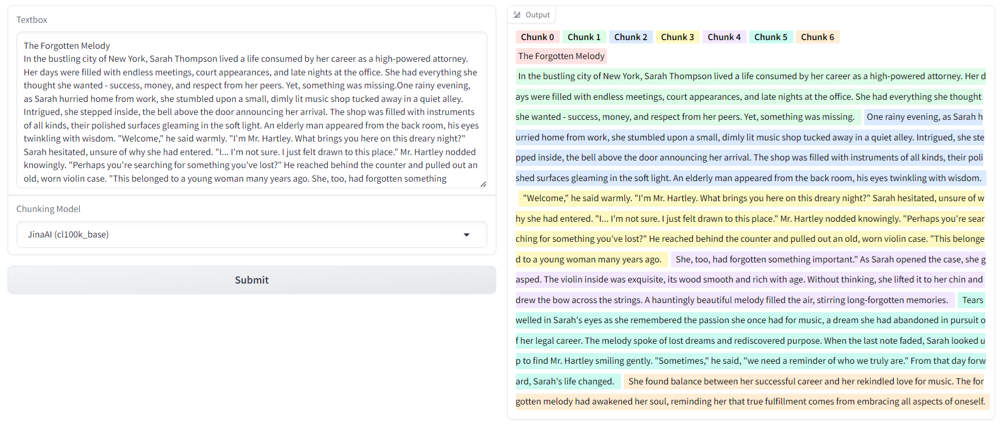

# chunk-visualizer
This repository is a chunk visualizer.

The prompt is heighlighted by chunks.

<p align="center">
    
</p>

## Installation
```
python3.10 -m venv .venv
pip install -r requirements.txt
```
## Usage
We provide an interface on gradio.
```
python app.py
```
Then, go to http://127.0.0.1:7860

## Chunk splitting model
We can provide chunk splitting models below.
|Provider|Model name|
|---|---|
|[Jina AI](https://jina.ai/tokenizer/)|cl100k_base|
